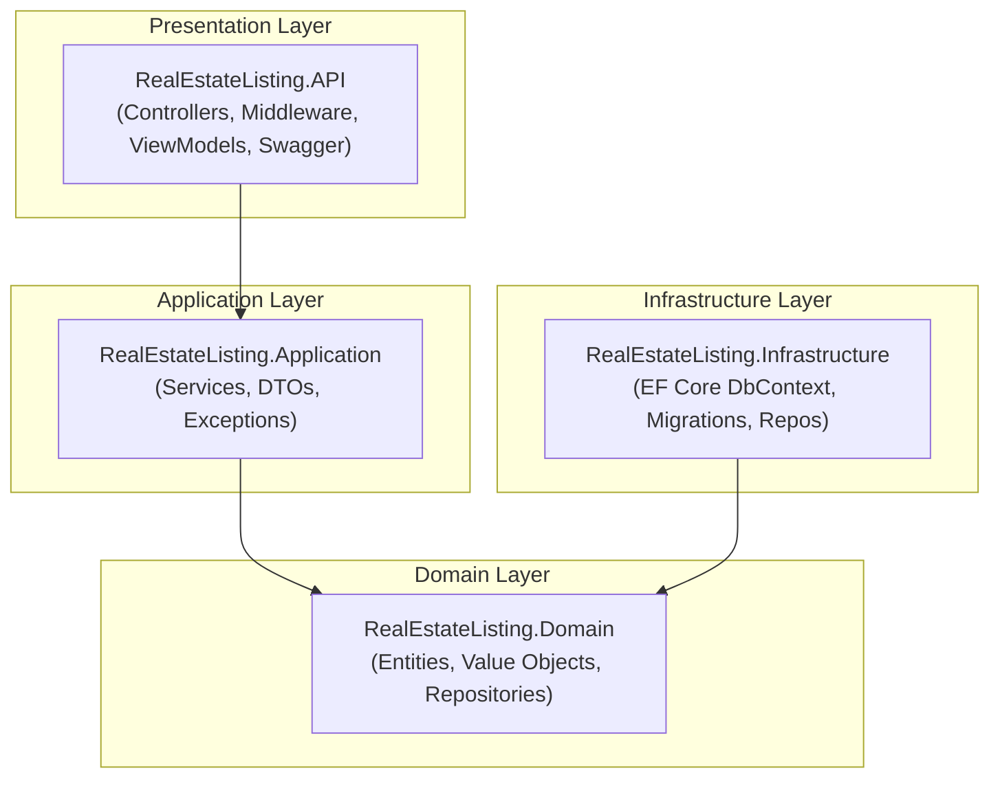
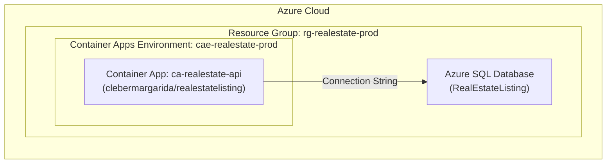

# Real Estate Listing API

[](https://github.com/cleberMargarida/RealEstateListing/actions/workflows/ci-cd.yml)
[](https://codecov.io/gh/cleberMargarida/real-estate-listing)
[](https://hub.docker.com/r/clebermargarida/realestatelisting)
[](LICENSE)

A small, opinionated REST API for managing real estate property listings. Built with **C#** and **ASP.NET Core (.NET 10)**, using **EF Core** with **SQL Server** for persistence. Includes Swagger documentation, unit and integration tests, CI/CD with coverage reporting, Docker support, and automated deployment to Azure Container Apps.

---

## 📋 Table of Contents

- [Features](#-features)
- [Architecture](#-architecture)
- [Prerequisites](#-prerequisites)
- [Quick Start](#-quick-start)
- [Running Locally](#-running-locally)
- [Docker](#-docker)
- [Database & Migrations](#-database--migrations)
- [API Documentation](#-api-documentation)
- [Testing & CI](#-testing--ci)
- [Azure Deployment](#-azure-deployment)
- [Contributing](#-contributing)
- [License](#-license)
- [Troubleshooting](#-troubleshooting)

---

## ✨ Features

- **CRUD Operations**: Create, read, update, and delete property listings
- **State Transitions**: Publish and archive listings with business rule validation
- **Swagger/OpenAPI**: Interactive API documentation
- **EF Core Migrations**: Database versioning and schema management
- **Exception Handling**: Centralized middleware for consistent error responses
- **Unit & Integration Tests**: Comprehensive test coverage with xUnit
- **CI/CD Pipeline**: Automated builds, tests, and deployments via GitHub Actions
- **Docker Support**: Containerized deployment
- **Azure Container Apps**: Cloud-native deployment

---

## 🏗 Architecture



See the [architecture diagram](docs/architecture.md) for more details.

---

## 📦 Prerequisites

- [.NET 10 SDK](https://dotnet.microsoft.com/download/dotnet/10.0)
- [SQL Server](https://www.microsoft.com/sql-server) (or LocalDB for local development)
- [Docker](https://www.docker.com/) (optional, for containerized runs)
- [EF Core CLI Tools](https://learn.microsoft.com/ef/core/cli/dotnet) (optional, for migrations)

```bash
# Install EF Core tools globally
dotnet tool install --global dotnet-ef
```

---

## 🚀 Quick Start

```bash
# Clone the repository
git clone https://github.com/cleberMargarida/real-estate-listing.git
cd real-estate-listing

# Restore dependencies
dotnet restore

# Build
dotnet build --configuration Release

# Run the API
dotnet run --project src/RealEstateListing.API

# Open Swagger UI
# https://localhost:7258/swagger (HTTPS)
# http://localhost:5101/swagger (HTTP)
```

---

## 💻 Running Locally

### Using .NET CLI

1. **Configure the database connection** (optional):  
   Update `src/RealEstateListing.API/appsettings.Development.json`:
   ```json
   {
     "ConnectionStrings": {
       "SqlServer": "Server=(localdb)\\MSSQLLocalDB;Database=RealEstateListing;Trusted_Connection=True;MultipleActiveResultSets=true"
     }
   }
   ```

2. **Run the application**:
   ```bash
   dotnet run --project src/RealEstateListing.API
   ```

3. **Access the API**:
   - Swagger UI: https://localhost:7258/swagger
   - HTTP endpoint: http://localhost:5101

> **Note**: In Development mode, database migrations are applied automatically on startup.

---

## 🐳 Docker

### Build and Run with Docker

```bash
# Build the image
docker build -t realestatelisting:local .

# Run the container
docker run -p 5000:8080 -p 5001:8081 \
  -e ConnectionStrings__SqlServer="<your-connection-string>" \
  realestatelisting:local

# Access the API
# http://localhost:5000/swagger
```

### Environment Variables

| Variable | Description | Required |
|----------|-------------|----------|
| `ConnectionStrings__SqlServer` | SQL Server connection string | Yes |

### Docker Hub

Pre-built images are available on Docker Hub:

```bash
docker pull clebermargarida/realestatelisting:latest
```

---

## 🗄 Database & Migrations

The application uses EF Core with SQL Server. Migrations are located in `src/RealEstateListing.Infrastructure/Migrations`.

### Create a new migration

```bash
dotnet ef migrations add <MigrationName> \
  --project src/RealEstateListing.Infrastructure \
  --startup-project src/RealEstateListing.API \
  --context ApplicationDbContext
```

### Apply migrations manually

```bash
dotnet ef database update \
  --project src/RealEstateListing.Infrastructure \
  --startup-project src/RealEstateListing.API \
  --context ApplicationDbContext
```

> **Note**: Migrations are applied automatically in Development mode.

---

## 📖 API Documentation

Swagger UI is available at `/swagger` when running in Development mode.

### Endpoints

| Method | Endpoint | Description |
|--------|----------|-------------|
| `GET` | `/api/listings` | Get all listings |
| `GET` | `/api/listings/{id}` | Get listing by ID |
| `POST` | `/api/listings` | Create a new listing |
| `PUT` | `/api/listings/{id}` | Update a listing (full replace) |
| `PATCH` | `/api/listings/{id}/publish` | Publish a draft listing |
| `PATCH` | `/api/listings/{id}/archive` | Archive a published listing |
| `DELETE` | `/api/listings/{id}` | Delete a listing |

### Response Codes

| Code | Description |
|------|-------------|
| `200 OK` | Successful GET request |
| `201 Created` | Resource created successfully |
| `204 No Content` | Successful update/delete |
| `400 Bad Request` | Invalid request data |
| `404 Not Found` | Resource not found |
| `422 Unprocessable Entity` | Business rule violation |
| `500 Internal Server Error` | Server error |

---

## 🧪 Testing & CI

### Run Tests Locally

```bash
# Run all tests
dotnet test

# Run unit tests only
dotnet test tests/RealEstateListing.Domain.UnitTests
dotnet test tests/RealEstateListing.Application.UnitTests

# Run integration tests
dotnet test tests/RealEstateListing.IntegrationTests

# Run with coverage
dotnet test --collect:"XPlat Code Coverage"
```

### CI/CD Pipeline

The project uses GitHub Actions for CI/CD:

1. **Build**: Compiles the solution
2. **Unit Tests**: Runs domain and application unit tests with coverage
3. **Integration Tests**: Runs integration tests with coverage
4. **Test Report**: Merges coverage reports and uploads to Codecov
5. **Publish Docker Image**: Builds and pushes to Docker Hub (on release)
6. **Deploy to Azure**: Deploys to Azure Container Apps (on release)

### Coverage

Coverage target is set to **70%** in [codecov.yml](codecov.yml).

---

## ☁️ Azure Deployment

The API is deployed to **Azure Container Apps** and is publicly accessible.

### Live Demo

🔗 **Production URL**: https://ca-realestate-api.thankfulstone-3c733688.brazilsouth.azurecontainerapps.io/swagger/index.html

### Azure Resources

| Resource | Name | Description |
|----------|------|-------------|
| Resource Group | `rg-realestate-prod` | Contains all resources |
| Container App | `ca-realestate-api` | The API application |
| Container Apps Environment | `cae-realestate-prod` | Container Apps hosting environment |
| Azure SQL Database | - | Production database |

### Architecture Diagram




### Required Secrets for CI/CD

Configure these secrets in your GitHub repository:

| Secret | Description |
|--------|-------------|
| `DOCKERHUB_USERNAME` | Docker Hub username |
| `DOCKERHUB_TOKEN` | Docker Hub access token |
| `AZURE_CREDENTIALS` | Azure service principal credentials (JSON) |
| `CODECOV_TOKEN` | Codecov upload token |

### Application Settings (Azure Container Apps)

Configure these environment variables in your Container App:

| Setting | Description |
|---------|-------------|
| `ConnectionStrings__SqlServer` | Production SQL Server connection string |

---

## 🤝 Contributing

Contributions are welcome! Please read our [Contributing Guide](CONTRIBUTING.md) for details on our code of conduct and the process for submitting pull requests.

---

## 📄 License

This project is licensed under the MIT License - see the [LICENSE](LICENSE) file for details.

---

## ❓ Troubleshooting

### Common Issues

**Q: The application fails to connect to the database**  
A: Ensure your connection string is correct and SQL Server is running. Check that the database exists or let EF Core create it via migrations.

**Q: Swagger UI is not available**  
A: Swagger is only enabled in Development mode. Make sure `ASPNETCORE_ENVIRONMENT=Development` is set.

**Q: Docker container fails to start**  
A: Verify the `ConnectionStrings__SqlServer` environment variable is set correctly. Note the double underscore (`__`) syntax for nested configuration.

**Q: Migrations fail to apply**  
A: Ensure you have the EF Core CLI tools installed (`dotnet tool install --global dotnet-ef`) and the correct project paths.

### Getting Help

- Open an [issue](https://github.com/cleberMargarida/real-estate-listing/issues)
- Check existing [discussions](https://github.com/cleberMargarida/real-estate-listing/discussions)

---

Made with ❤️ by [Cleber Margarida](https://github.com/cleberMargarida)
