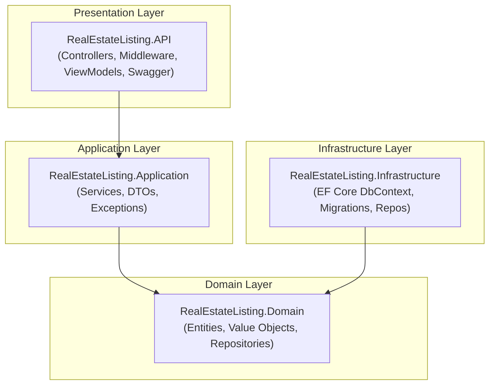

# Real Estate Listing API

[](https://github.com/cleberMargarida/RealEstateListing/actions/workflows/ci-cd.yml)
[](https://codecov.io/gh/cleberMargarida/real-estate-listing)
[](https://hub.docker.com/r/clebermargarida/realestatelisting)
[](LICENSE)

A small, opinionated REST API for managing real estate property listings. Built with **C#** and **ASP.NET Core (.NET 10)**, using **EF Core** with **SQL Server** for persistence.

<p align="center">
  <a href="https://clebermargarida.github.io/real-estate-listing/"><strong>📚 Explore the Full Documentation »</strong></a>
</p>

<p align="center">
  <a href="https://clebermargarida.github.io/real-estate-listing/getting-started/quick-start.html">Quick Start</a>
  ·
  <a href="https://clebermargarida.github.io/real-estate-listing/api/">API Reference</a>
  ·
  <a href="https://ca-realestate-api.thankfulstone-3c733688.brazilsouth.azurecontainerapps.io/swagger/index.html">Live Demo</a>
  ·
  <a href="https://github.com/cleberMargarida/real-estate-listing/issues">Report Bug</a>
</p>

---

## ✨ Features

| Feature | Description |
|---------|-------------|
| **CRUD Operations** | Create, read, update, and delete property listings |
| **State Transitions** | Publish and archive listings with business rule validation |
| **Swagger/OpenAPI** | Interactive API documentation |
| **EF Core Migrations** | Database versioning and schema management |
| **Docker Support** | Containerized deployment ready |
| **Azure Container Apps** | Cloud-native deployment |
| **CI/CD Pipeline** | Automated builds, tests, and deployments |
| **70%+ Test Coverage** | Comprehensive unit and integration tests |

---

## 🚀 Quick Start

```bash
# Clone the repository
git clone https://github.com/cleberMargarida/real-estate-listing.git
cd real-estate-listing

# Restore and run
dotnet restore
dotnet run --project src/RealEstateListing.API

# Open Swagger UI at https://localhost:7258/swagger
```

> **Need more details?** Check out the [Installation Guide](https://clebermargarida.github.io/real-estate-listing/getting-started/installation.html) for prerequisites and configuration options.

---

## 🏗 Architecture



> 📖 [View detailed architecture documentation](https://clebermargarida.github.io/real-estate-listing/architecture/)

---

## 📖 Documentation

Our comprehensive documentation is hosted on GitHub Pages and includes:

| Section | Description |
|---------|-------------|
| [**Getting Started**](https://clebermargarida.github.io/real-estate-listing/getting-started/) | Installation, prerequisites, and quick start guide |
| [**API Endpoints**](https://clebermargarida.github.io/real-estate-listing/api-endpoints/listings.html) | Complete REST API reference with examples |
| [**Architecture**](https://clebermargarida.github.io/real-estate-listing/architecture/) | System design and project structure |
| [**API Reference**](https://clebermargarida.github.io/real-estate-listing/api/) | Auto-generated C# API documentation |
| [**Deployment**](https://clebermargarida.github.io/real-estate-listing/deployment/docker.html) | Docker and Azure deployment guides |

---

## 🐳 Docker

```bash
# Using pre-built image from Docker Hub
docker pull clebermargarida/realestatelisting:latest

docker run -p 5000:8080 \
  -e ConnectionStrings__SqlServer="<your-connection-string>" \
  clebermargarida/realestatelisting:latest
```

> 📖 [Full Docker documentation](https://clebermargarida.github.io/real-estate-listing/deployment/docker.html)

---

## ☁️ Live Demo

The API is deployed to **Azure Container Apps** and is publicly accessible:

🔗 **[Try it now on Swagger UI](https://ca-realestate-api.thankfulstone-3c733688.brazilsouth.azurecontainerapps.io/swagger/index.html)**

> 📖 [Azure deployment documentation](https://clebermargarida.github.io/real-estate-listing/deployment/azure.html)

---

## 🧪 Testing

```bash
# Run all tests
dotnet test

# Run with coverage
dotnet test --collect:"XPlat Code Coverage"
```

Coverage target: **70%** · [](https://codecov.io/gh/cleberMargarida/real-estate-listing)

---

## 🤝 Contributing

Contributions are welcome! Please read our [Contributing Guide](CONTRIBUTING.md) for details on our code of conduct and the process for submitting pull requests.

---

## 📄 License

This project is licensed under the MIT License - see the [LICENSE](LICENSE) file for details.

---

<p align="center">
  Made with ❤️ by <a href="https://github.com/cleberMargarida">Cleber Margarida</a>
</p>

<p align="center">
  <a href="https://clebermargarida.github.io/real-estate-listing/">Documentation</a>
  ·
  <a href="https://github.com/cleberMargarida/real-estate-listing/issues">Issues</a>
  ·
  <a href="https://github.com/cleberMargarida/real-estate-listing/discussions">Discussions</a>
</p>
