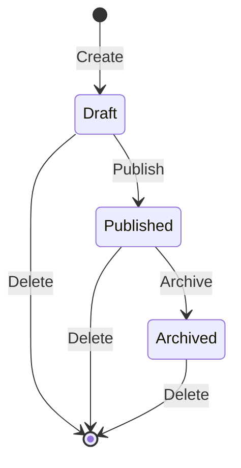

# Listings API

The Listings API provides endpoints for managing real estate property listings.

## Endpoints

| Method | Endpoint | Description |
|--------|----------|-------------|
| `GET` | `/api/listings` | Get all listings |
| `GET` | `/api/listings/{id}` | Get listing by ID |
| `POST` | `/api/listings` | Create a new listing |
| `PUT` | `/api/listings/{id}` | Update a listing (full replace) |
| `PATCH` | `/api/listings/{id}/publish` | Publish a draft listing |
| `PATCH` | `/api/listings/{id}/archive` | Archive a published listing |
| `DELETE` | `/api/listings/{id}` | Delete a listing |

## Response Codes

| Code | Description |
|------|-------------|
| `200 OK` | Successful GET request |
| `201 Created` | Resource created successfully |
| `204 No Content` | Successful update/delete |
| `400 Bad Request` | Invalid request data |
| `404 Not Found` | Resource not found |
| `422 Unprocessable Entity` | Business rule violation |
| `500 Internal Server Error` | Server error |

## Listing States

Listings can be in one of three states:



- **Draft**: Initial state when a listing is created
- **Published**: Listing is live and visible
- **Archived**: Listing is no longer active

## Create a Listing

### Request

```http
POST /api/listings
Content-Type: application/json

{
  "title": "Modern Downtown Apartment",
  "description": "Beautiful 2-bedroom apartment in the heart of the city",
  "price": 350000,
  "address": {
    "street": "123 Main Street",
    "city": "São Paulo",
    "state": "SP",
    "zipCode": "01310-100",
    "country": "Brazil"
  },
  "bedrooms": 2,
  "bathrooms": 1,
  "area": 75
}
```

### Response

```http
HTTP/1.1 201 Created
Location: /api/listings/1

{
  "id": 1,
  "title": "Modern Downtown Apartment",
  "description": "Beautiful 2-bedroom apartment in the heart of the city",
  "price": 350000,
  "address": {
    "street": "123 Main Street",
    "city": "São Paulo",
    "state": "SP",
    "zipCode": "01310-100",
    "country": "Brazil"
  },
  "bedrooms": 2,
  "bathrooms": 1,
  "area": 75,
  "status": "Draft",
  "createdAt": "2026-01-19T10:00:00Z",
  "updatedAt": "2026-01-19T10:00:00Z"
}
```

## Get All Listings

### Request

```http
GET /api/listings
```

### Response

```http
HTTP/1.1 200 OK

[
  {
    "id": 1,
    "title": "Modern Downtown Apartment",
    "price": 350000,
    "status": "Draft",
    ...
  }
]
```

## Get a Listing

### Request

```http
GET /api/listings/1
```

### Response

```http
HTTP/1.1 200 OK

{
  "id": 1,
  "title": "Modern Downtown Apartment",
  ...
}
```

## Update a Listing

### Request

```http
PUT /api/listings/1
Content-Type: application/json

{
  "title": "Updated Apartment Title",
  "description": "Updated description",
  "price": 375000,
  ...
}
```

### Response

```http
HTTP/1.1 204 No Content
```

## Publish a Listing

Transitions a listing from **Draft** to **Published** state.

### Request

```http
PATCH /api/listings/1/publish
```

### Response

```http
HTTP/1.1 204 No Content
```

### Error Response

If the listing is not in Draft state:

```http
HTTP/1.1 422 Unprocessable Entity

{
  "error": "Listing must be in Draft state to publish"
}
```

## Archive a Listing

Transitions a listing from **Published** to **Archived** state.

### Request

```http
PATCH /api/listings/1/archive
```

### Response

```http
HTTP/1.1 204 No Content
```

## Delete a Listing

### Request

```http
DELETE /api/listings/1
```

### Response

```http
HTTP/1.1 204 No Content
```
