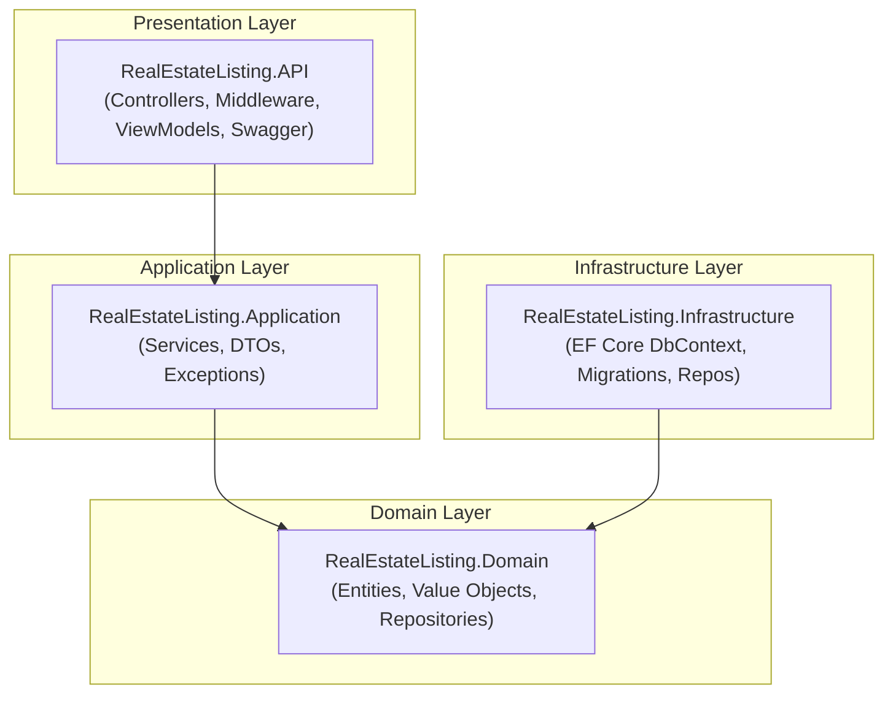
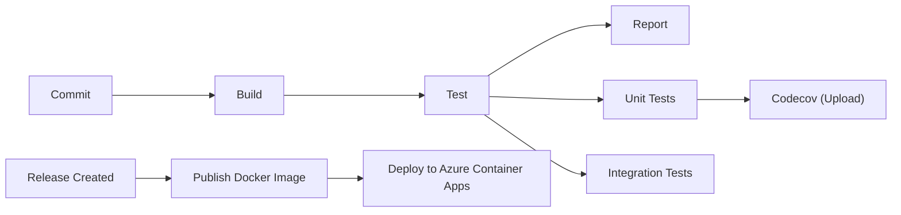

# Architecture Overview

This document describes the high-level architecture of the Real Estate Listing API.

## Layered Architecture

The application follows a **Clean Architecture** pattern with four distinct layers:



## Layer Responsibilities

### Presentation Layer (RealEstateListing.API)

The API layer handles HTTP requests and responses:

- **Controllers**: Define REST endpoints and handle HTTP verbs
- **Middleware**: Cross-cutting concerns like exception handling
- **ViewModels**: Request/response DTOs for API contracts
- **Swagger**: OpenAPI documentation and configuration

### Application Layer (RealEstateListing.Application)

The application layer orchestrates business operations:

- **Services**: Implement use cases and business logic
- **DTOs**: Data transfer objects for layer communication
- **Exceptions**: Application-specific error handling

### Domain Layer (RealEstateListing.Domain)

The domain layer contains the core business logic:

- **Entities**: Core business objects (e.g., `Listing`)
- **Value Objects**: Immutable objects (e.g., `Address`, `Money`)
- **Repository Interfaces**: Abstractions for data access

### Infrastructure Layer (RealEstateListing.Infrastructure)

The infrastructure layer handles external concerns:

- **DbContext**: EF Core database context
- **Migrations**: Database schema versioning
- **Repositories**: Concrete implementations of repository interfaces

## Dependency Flow

Dependencies flow **inward** toward the domain:

```
API → Application → Domain ← Infrastructure
```

- API depends on Application
- Application depends on Domain
- Infrastructure depends on Domain
- Domain has no external dependencies

## Azure Deployment Architecture

```mermaid
flowchart LR
  subgraph "Azure Cloud"
    subgraph "Resource Group: rg-realestate-prod"
      subgraph "Container Apps Environment: cae-realestate-prod"
        CA["Container App: ca-realestate-api<br/>(clebermargarida/realestatelisting)"]
      end
      SQL["Azure SQL Database<br/>(RealEstateListing)"]
    end
  end
  CA -->|Connection String| SQL

```mermaid
flowchart LR
  Docker["Docker Hub<br/>(Image Registry)"]
  GH["GitHub Actions<br/>(CI/CD Pipeline)"]
  Codecov["Codecov<br/>(Coverage)"]
  Docker --> GH
  GH --> Codecov
```


## CI/CD Pipeline




## Key Design Decisions

1. **Clean Architecture**: Enables testability and maintainability
2. **EF Core**: Provides robust ORM with migrations
3. **Swagger**: Self-documenting API
4. **Docker**: Containerization for consistent deployments
5. **Azure Container Apps**: Container hosting
