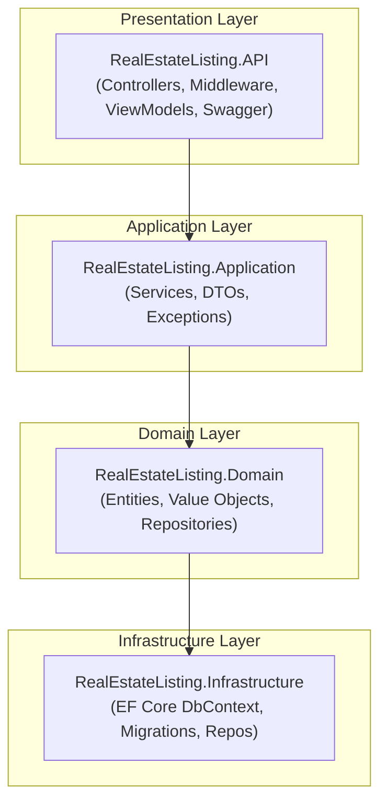
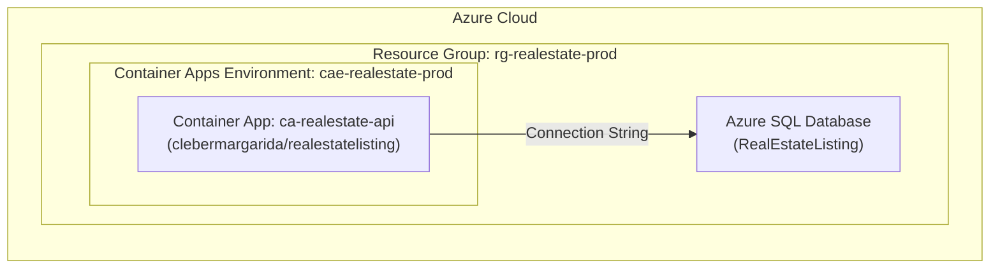
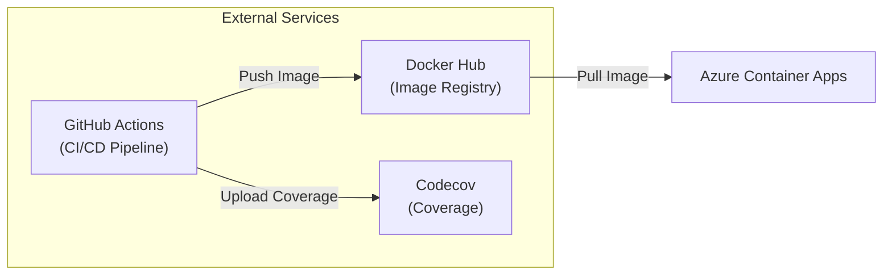

# Architecture Overview

This document describes the high-level architecture of the Real Estate Listing API.

## Layered Architecture

The application follows a **Clean Architecture** pattern with four distinct layers:



## Layer Responsibilities

### Presentation Layer (RealEstateListing.API)

The API layer handles HTTP requests and responses:

- **Controllers**: Define REST endpoints and handle HTTP verbs
- **Middleware**: Cross-cutting concerns like exception handling
- **ViewModels**: Request/response DTOs for API contracts
- **Swagger**: OpenAPI documentation and configuration

### Application Layer (RealEstateListing.Application)

The application layer orchestrates business operations:

- **Services**: Implement use cases and business logic
- **DTOs**: Data transfer objects for layer communication
- **Exceptions**: Application-specific error handling

### Domain Layer (RealEstateListing.Domain)

The domain layer contains the core business logic:

- **Entities**: Core business objects (e.g., `Listing`)
- **Value Objects**: Immutable objects (e.g., `Address`, `Money`)
- **Repository Interfaces**: Abstractions for data access

### Infrastructure Layer (RealEstateListing.Infrastructure)

The infrastructure layer handles external concerns:

- **DbContext**: EF Core database context
- **Migrations**: Database schema versioning
- **Repositories**: Concrete implementations of repository interfaces

## Dependency Flow

Dependencies flow **inward** toward the domain:

```
API → Application → Domain ← Infrastructure
```

- API depends on Application
- Application depends on Domain
- Infrastructure depends on Domain
- Domain has no external dependencies

## Azure Deployment Architecture



## CI/CD Pipeline



The project uses GitHub Actions for CI/CD:

1. **Build**: Compiles the solution
2. **Unit Tests**: Runs domain and application unit tests with coverage
3. **Integration Tests**: Runs integration tests with coverage
4. **Test Report**: Merges coverage reports and uploads to Codecov
5. **Publish Docker Image**: Builds and pushes to Docker Hub (on release)
6. **Deploy to Azure**: Deploys to Azure Container Apps (on release)

## Project Structure

```
real-estate-listing/
├── src/
│   ├── RealEstateListing.API/           # Presentation layer
│   ├── RealEstateListing.Application/   # Application layer
│   ├── RealEstateListing.Domain/        # Domain layer
│   └── RealEstateListing.Infrastructure/ # Infrastructure layer
├── tests/
│   ├── RealEstateListing.Domain.UnitTests/
│   ├── RealEstateListing.Application.UnitTests/
│   └── RealEstateListing.IntegrationTests/
├── docs/                                 # Documentation
├── Dockerfile
└── RealEstateListing.slnx
```
