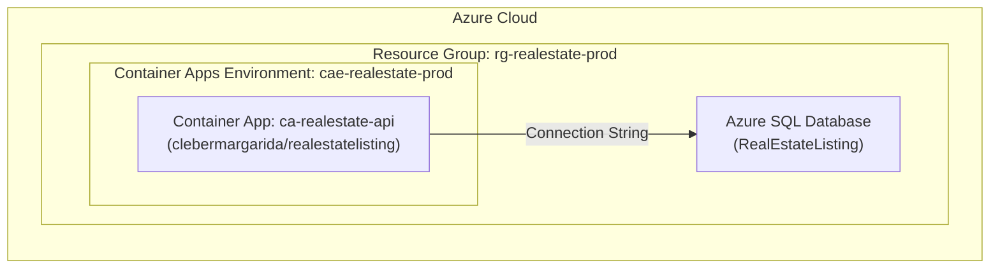

# Azure Container Apps Deployment

This guide covers deploying the Real Estate Listing API to Azure Container Apps.

## Live Demo

The API is currently deployed and publicly accessible:

🔗 **Production URL**: https://ca-realestate-api.thankfulstone-3c733688.brazilsouth.azurecontainerapps.io/swagger/index.html

## Azure Resources

The production deployment uses the following Azure resources:

| Resource | Name | Description |
|----------|------|-------------|
| Resource Group | `rg-realestate-prod` | Contains all resources |
| Container App | `ca-realestate-api` | The API application |
| Container Apps Environment | `cae-realestate-prod` | Container Apps hosting environment |
| Azure SQL Database | - | Production database |

## Architecture



## CI/CD Deployment

The API is automatically deployed via GitHub Actions when a new release is published:

1. **Build & Test**: Solution is built and all tests pass
2. **Publish Image**: Docker image is pushed to Docker Hub
3. **Deploy**: Azure Container Apps pulls the new image

### Required Secrets

Configure these secrets in your GitHub repository:

| Secret | Description |
|--------|-------------|
| `DOCKERHUB_USERNAME` | Docker Hub username |
| `DOCKERHUB_TOKEN` | Docker Hub access token |
| `AZURE_CREDENTIALS` | Azure service principal credentials (JSON) |
| `CODECOV_TOKEN` | Codecov upload token |

### Azure Credentials Format

The `AZURE_CREDENTIALS` secret should be a JSON object:

```json
{
  "clientId": "<service-principal-app-id>",
  "clientSecret": "<service-principal-password>",
  "subscriptionId": "<azure-subscription-id>",
  "tenantId": "<azure-ad-tenant-id>"
}
```

## Manual Deployment

### Prerequisites

- [Azure CLI](https://learn.microsoft.com/cli/azure/install-azure-cli)
- Azure subscription

### Deploy Steps

1. **Login to Azure**:
   ```bash
   az login
   ```

2. **Create Resource Group** (if not exists):
   ```bash
   az group create --name rg-realestate-prod --location brazilsouth
   ```

3. **Create Container Apps Environment**:
   ```bash
   az containerapp env create \
     --name cae-realestate-prod \
     --resource-group rg-realestate-prod \
     --location brazilsouth
   ```

4. **Create Container App**:
   ```bash
   az containerapp create \
     --name ca-realestate-api \
     --resource-group rg-realestate-prod \
     --environment cae-realestate-prod \
     --image clebermargarida/realestatelisting:latest \
     --target-port 8080 \
     --ingress external \
     --env-vars ConnectionStrings__SqlServer="<your-connection-string>"
   ```

5. **Update Container App** (for new versions):
   ```bash
   az containerapp update \
     --name ca-realestate-api \
     --resource-group rg-realestate-prod \
     --image clebermargarida/realestatelisting:1.0.0
   ```

## Application Settings

Configure these environment variables in your Container App:

| Setting | Description |
|---------|-------------|
| `ConnectionStrings__SqlServer` | Production SQL Server connection string |

## Scaling

Azure Container Apps supports automatic scaling. Configure via:

```bash
az containerapp update \
  --name ca-realestate-api \
  --resource-group rg-realestate-prod \
  --min-replicas 1 \
  --max-replicas 10
```

## Monitoring

Access logs and metrics via:

- **Azure Portal**: Navigate to the Container App resource
- **Log Analytics**: Query container logs
- **Azure Monitor**: Set up alerts and dashboards
